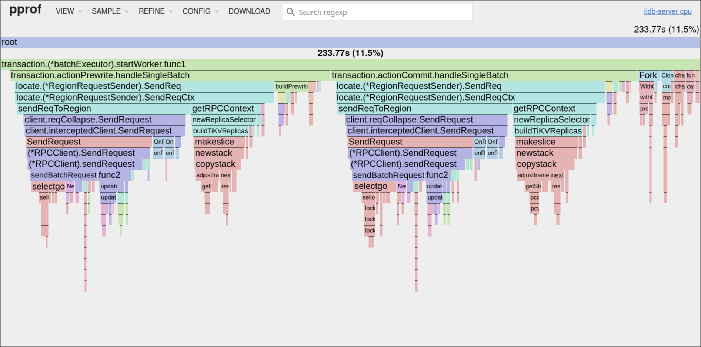
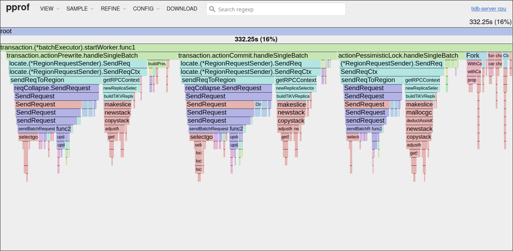

# Revisiting the TiDB CPU Gap Between Mlog and a Non-Unique Index

**Date**: 2026-03-19

## TL;DR

Our earlier write-up emphasized the extra generic insert work in the mlog path. That cost is still real, but it no longer looks like the best explanation for the **TiDB CPU gap between mlog and a non-unique index** in the benchmark that matters here.

This round adds a transaction-mode control and merged TiDB CPU profiles for all six cases. Taken together, the newer evidence points to a different primary conclusion:

- Under **pessimistic auto-commit**, most of the extra TiDB CPU that mlog spends over index is **driven by the additional pessimistic lock path**
- Under **optimistic** transactions, that extra CPU distance between mlog and index nearly disappears
- In the merged pprof output, the clearest hotspot shift is in `SendReqCtx`, with `mallocgc` moving in the same direction; both track the presence of extra `kv_pessimistic_lock` RPCs
- The generic insert path, row construction, and prewrite/commit work are still real, but they behave much more like **background mlog overhead** than the main differentiator in pessimistic mode

In short, mlog does impose real extra work beyond a non-unique index. But in this benchmark, what places it clearly above index is mostly the pessimistic lock path, not the generic table-insert path alone.

## Why This Update Is Necessary

The previous analysis focused on code-path structure: index maintenance uses an index-specific fast path, while mlog performs an additional full-table insert into the `$mlog$...` table. That observation is still correct, and it still helps explain why mlog is not simply another index write.

What changed is the strength of the attribution evidence. This round gives us two things the earlier version did not have:

1. A **transaction-mode control**: baseline / index / mlog are each tested in both pessimistic and optimistic modes
2. **Merged CPU profiles** from three TiDB nodes for all six cases

Together, they answer the narrower question we actually care about more directly: **why does mlog sit above index on TiDB CPU in pessimistic auto-commit?**

With that evidence in place, the earlier "generic insert path is the main cause" framing becomes incomplete. The generic path still explains why mlog has overhead of its own. It does not, by itself, explain why the extra distance between mlog and index is pronounced in pessimistic mode and nearly disappears in optimistic mode.

## Benchmark Setup

The benchmark matrix is intentionally simple:

| Case | Scenario | Transaction Mode |
| --- | --- | --- |
| 1 | baseline | pessimistic |
| 2 | index | pessimistic |
| 3 | mlog-noshard | pessimistic |
| 4 | baseline | optimistic |
| 5 | index | optimistic |
| 6 | mlog-noshard | optimistic |

Shared conditions:

- Base table: `bc_bet_records`
- 11-column non-unique index vs mlog tracking the same 11 columns
- No shard for the mlog table
- `batch_size=1`
- 128 threads
- Rate limit: 18,000 rows/s
- 3 TiDB nodes, round-robin traffic

This note focuses on **TiDB CPU attribution**, not on giving a full performance report for every metric.

## The Short Version of What the Data Says

The cluster-level numbers already point in a clear direction. To keep the two most useful definitions of the mlog-vs-index gap separate, the table shows both the raw TiDB CPU-point difference and the difference in relative uplift over baseline.

| Mode | Baseline TiDB CPU | Index TiDB CPU | Mlog TiDB CPU | Raw CPU Gap | Uplift Gap vs Baseline | Index PessLock/s | Mlog PessLock/s |
| --- | ---: | ---: | ---: | ---: | ---: | ---: | ---: |
| pessimistic | 36.0% | 41.5% (+15.3%) | 43.6% (+21.1%) | **+2.1pp** | **+5.8pp** | 35,022 | 52,834 |
| optimistic | 30.3% | 35.7% (+17.8%) | 35.8% (+18.2%) | **+0.1pp** | **+0.4pp** | 1 | 0 |

These two gap measures answer slightly different questions. The raw CPU gap shows how far mlog sits above index in absolute TiDB CPU usage. The uplift gap shows how much more relative overhead mlog adds beyond what index already adds over the corresponding baseline. The attribution argument in the rest of this note mainly relies on the second view.

Three things stand out immediately:

- In pessimistic mode, mlog still sits visibly above index on TiDB CPU
- In optimistic mode, that extra distance nearly disappears
- Among the write-path RPC counters, `kv_pessimistic_lock` is the one that collapses from a clear signal in pessimistic mode to near zero in optimistic mode

A small RPC counter snapshot makes the baseline comparison explicit:

| Mode | Counter | Baseline | Index | Mlog |
| --- | --- | ---: | ---: | ---: |
| pessimistic | `PessLock/s` | 34,913 | 35,022 | 52,834 |
| pessimistic | `Prewrite/s` | 34,917 | 49,853 | 52,840 |
| pessimistic | `Commit/s` | 33,863 | 48,914 | 52,837 |
| optimistic | `PessLock/s` | 16 | 1 | 0 |
| optimistic | `Prewrite/s` | 34,864 | 50,116 | 52,899 |
| optimistic | `Commit/s` | 33,766 | 49,416 | 52,896 |

This does not prove that every remaining CPU second is caused by pessimistic locking. It does, however, make pessimistic locking the strongest first suspect.

The next question is whether the merged profiles isolate the same mode-sensitive shift at the hotspot level. They largely do. The table below keeps only the functions most relevant to attribution, and all values are merged **cum time** across three TiDB nodes:

| Function (cum time) | BL-pess | Idx-pess | Mlog-pess | BL-opt | Idx-opt | Mlog-opt |
| --- | ---: | ---: | ---: | ---: | ---: | ---: |
| Total samples | 1731s | 2038s | 2076s | 1494s | 1743s | 1696s |
| `handlePessimisticDML` | 255s | 315s | 260s | — | — | — |
| `pessimisticLockMutations` | 84s | 87s | 58s | — | — | — |
| `SendReqCtx` | 185s | 234s | 280s | 135s | 184s | 189s |
| `Prewrite.handleSingle` | 81s | 107s | 111s | 89s | 122s | 124s |
| `Commit.handleSingle` | 74s | 103s | 104s | 73s | 97s | 100s |
| `mallocgc` | 288s | 337s | 360s | 250s | 290s | 285s |
| `insertRows` | 139s | 195s | 167s | 135s | 183s | 160s |
| `buildInsert` | 175s | 188s | 186s | 165s | 173s | 174s |
| `startWorker.func1` | 171s | 234s | 332s | 178s | 241s | 248s |

This table helps separate the signals that move with transaction mode from the ones that do not:

- `SendReqCtx` is the clearest hotspot shift: mlog sits **46s** above index in pessimistic mode, but only **5s** above it in optimistic mode
- `mallocgc` follows the same pattern, which strongly suggests extra request construction and serialization work around the pessimistic lock path
- `Prewrite.handleSingle` and `Commit.handleSingle` do not show the same transaction-mode-sensitive shift
- The insert-related functions are harder to read from the raw cum-time table alone; the more informative view is their uplift relative to baseline, which stays similar across pessimistic and optimistic modes
- `pessimisticLockMutations` looks smaller for mlog at first glance, but that number is misleading on its own because a larger share of the lock work is shifted into worker goroutine stacks; the jump in `startWorker.func1` is the clue

Taken together, the non-lock hotspots look more like persistent mlog overhead than the main reason the mlog-vs-index distance widens in pessimistic mode.

### Flamegraph comparison

The screenshots below are easiest to read around the worker-side stack rooted at `startWorker.func1`, where the extra lock-related branch is most visible.





Read side by side, the two flamegraphs reinforce the same picture.

In the pessimistic **index** case, this worker-side view is still dominated by the shared write path: mostly the expected prewrite and commit branches, with `SendReqCtx` present but not unusually expanded.

In the pessimistic **mlog** case, the same area becomes visibly heavier. A lock-related branch through `actionPessimisticLock.handleSingleBatch` is more prominent under `startWorker.func1`, and the send path around `SendReqCtx` is broader as well.

So the visual difference is not a different execution model. It is a heavier lock-related layer added on top of the same familiar worker-side write path.

## Evidence Chain

### 1. The control experiment changes the answer

A simple falsifiable check is to hold everything else fixed and change only the transaction mode. If the main reason mlog sat above index were merely that it "does a second generic table insert," we would not expect that change alone to nearly erase the **extra distance between mlog and index**. The generic insert path is still present in both pessimistic and optimistic transactions.

But that is not what the benchmark shows.

The mlog-vs-index TiDB CPU uplift gap over baseline drops from **5.8 percentage points** in pessimistic mode to **0.4 percentage points** in optimistic mode. Even the raw TiDB CPU-point gap falls from **2.1pp** to **0.1pp**. That is a large change for a test where the schema, rate limit, row shape, and write amplification pattern are otherwise the same.

This does not mean the generic insert path has no cost. It means that generic insert cost is not the factor that best explains the **extra distance between mlog and index** under pessimistic auto-commit.

### 2. The request counters point to pessimistic lock first

The counter view points to pessimistic lock first. In pessimistic mode, index stays near baseline on `PessLock/s` (35,022 vs 34,913, or **+0.3%**), while mlog rises to **52,834** (**+51.3%**). In optimistic mode, `PessLock/s` drops to near zero across all three cases (**16 / 1 / 0**). For attribution purposes, those values are effectively zero and are better treated as background measurement noise than as a meaningful lock signal.

At the same time:

- `Prewrite/s` remains elevated for both index and mlog in both transaction modes
- `Commit/s` remains elevated for both index and mlog in both transaction modes

This matters because it separates two classes of work:

- **Transaction-mode-sensitive work**: pessimistic lock RPCs
- **Transaction-mode-insensitive work**: prewrite, commit, and the rest of the write pipeline

The first class lines up with the change in the mlog-vs-index TiDB CPU uplift gap. The second class mostly does not.

### 3. The strongest pprof signal is `SendReqCtx`

`SendReqCtx` is the shared send path for TiKV RPCs, including pessimistic lock, prewrite, and commit. In the merged profiles, it is the clearest hotspot shift.

Two comparisons are the most informative:

- In pessimistic mode, mlog is **46s** above index (`280s - 234s`)
- In optimistic mode, mlog is only **5s** above index (`189s - 184s`)

So when pessimistic locking disappears, roughly **41s** of the pessimistic mlog-vs-index `SendReqCtx` gap also disappears.

That is the cleanest attribution signal in the current data set.

It would be too strong to say that all 46s come from pessimistic lock RPCs. `SendReqCtx` still includes shared prewrite and commit traffic, and a small residual gap remains in optimistic mode. But the evidence strongly supports a more careful statement:

> The bulk of the extra `SendReqCtx` cost that mlog pays over index in pessimistic mode is most consistent with the extra pessimistic lock path.

### 4. `mallocgc` tells the same story

The memory-allocation signal moves in the same direction. Relative to baseline:

- Pessimistic mlog: **+25.0%**
- Optimistic mlog: **+14.0%**

This signal is less direct than `SendReqCtx`, but it still points the same way. The simplest explanation is that pessimistic mlog performs extra request construction, buffering, and serialization work around the pessimistic lock RPC path. When that path goes away, the allocation hotspot falls back toward the index range.

### 5. Why `pessimisticLockMutations` looks misleading

At first glance, one result looks contradictory:

- Mlog sends many more pessimistic lock RPCs
- Yet `pessimisticLockMutations` shows **lower** cum time in pprof than baseline or index

This is a stack-shape problem, not evidence that pessimistic locking is cheaper for mlog.

In `client-go`, pessimistic lock batches do not always stay on the same caller stack:

```text
doActionOnGroupMutations()
  -> send primary batch synchronously
  -> forget primary
  -> dispatch remaining batches
     -> if one batch remains: stay on the synchronous path
     -> if multiple batches remain: fork worker goroutines
```

That distinction matters here. In the baseline and index cases, the remaining pessimistic-lock work is more likely to stay on the synchronous path, so more CPU samples remain visible under `pessimisticLockMutations`. In the mlog case, the extra lock key makes the remaining lock work more likely to be dispatched through worker goroutines, so a larger share of the samples moves under `startWorker.func1` instead. That is why caller cum time under `pessimisticLockMutations` becomes a misleading standalone signal in this comparison.

The merged profiles line up with that explanation:

- `startWorker.func1` is **332s** for pessimistic mlog
- The same function is **248s** for optimistic mlog
- Baseline stays roughly flat (**171s** vs **178s**)

So the right reading is not "mlog spends less CPU in pessimistic locking." It is that the pessimistic lock work is distributed differently in the call graph, and caller cum time alone is not enough.

## What Still Remains True From the Earlier Analysis

The earlier analysis still captures several real sources of mlog overhead. What changes in this revision is not whether those costs exist, but how much explanatory weight they should carry in the final attribution.

The most useful way to think about the split is:

- **Pessimistic lock path** explains most of the *extra distance* between mlog and index in this benchmark
- **Generic insert and row-construction work** explain the *background cost* of maintaining mlog in either transaction mode

The profile data supports that split. That stability is easier to see in a baseline-relative view:

| Function | Pessimistic Mlog vs Baseline | Optimistic Mlog vs Baseline |
| --- | ---: | ---: |
| `Prewrite.handleSingle` | +37.0% | +39.3% |
| `Commit.handleSingle` | +40.5% | +37.0% |
| `insertRows` | +20.1% | +18.5% |
| `buildInsert` | +6.3% | +5.5% |

Those are exactly the kinds of costs we would expect from "mlog exists and writes extra data," but they are not specific to pessimistic locking.

### Generic table-insert path

The earlier document was right to call out that mlog is not maintained through the same lightweight path as a non-unique index.

Index maintenance mainly stays inside an index-specific flow: project values from the base row, encode index KV, and write it into the mem-buffer. Mlog, by contrast, materializes an additional row and inserts it into a separate physical mlog table. That second write goes through the generic table-insert pipeline, including handle or rowid allocation, row encoding, mem-buffer staging, record-key generation, assertion setup, and statistics updates.

That structural difference still matters. It explains why mlog has a real CPU cost even when the transaction mode changes, and it also explains why mlog should never be thought of as just another index append.

What it does **not** explain well enough on its own is the specific pattern we now observe in the benchmark: the extra CPU distance between mlog and index is clear in pessimistic mode and nearly gone in optimistic mode, even though the generic insert path exists in both. So this path remains a valid part of the story, just not the leading one.

### Datum deep copy

The earlier write-up was also right to flag datum copying during mlog row construction.

When the mlog row is built, tracked datum values are copied rather than merely referenced. For string or bytes values, decimals, and temporal types, that means real allocation and copy work. In a schema like this one, where several tracked columns fall into those categories, the effect is not theoretical.

This is a real source of mlog overhead, and it likely contributes to the persistent allocation pressure that remains visible even outside the pessimistic lock effect.

But it is still better understood as **row-construction cost** than as the main explanation for the pessimistic-mode distance relative to index. The same copying logic is still present when we switch to optimistic transactions, while the extra CPU distance between mlog and index almost disappears. That makes datum deep copy an important secondary factor, not the strongest attribution for the difference we are trying to explain here.

### ReservedRowIDAlloc

`ReservedRowIDAlloc` is worth discussing because readers naturally notice it, but the current assessment still stands: under this benchmark, it is unlikely to be a first-order performance factor.

Before writing the mlog row, TiDB temporarily resets and later restores the base table's reserved rowid state. That logic is needed so the mlog insert does not accidentally consume row IDs reserved for the base table itself. On the surface, that per-row state switch looks suspicious enough to deserve investigation.

Its **direct** cost is tiny. The state being reset is just a small pair of integer fields, so the reset/restore sequence itself is only a few reads and writes.

Its **indirect** cost also appears limited. Once the statement-level reservation is cleared, the mlog insert may fall back to the underlying rowid allocator more often. But that allocator uses a local cache and expands its range in batches, so the common case is still a cheap local increment rather than a full allocator refill. At this write rate, refill frequency should remain low enough that it does not plausibly dominate TiDB CPU.

So this remains the right way to frame it: `ReservedRowIDAlloc` reset/restore is correctness-isolation logic with some cost, but the current data does not support it as a major contributor to the observed mlog-vs-index CPU difference.

## Conclusion

- The latest evidence shows that the extra TiDB CPU distance between mlog and a non-unique index is **not best explained by the generic table-insert path alone**. That path is real, but it is not the main reason the distance widens under pessimistic auto-commit.
- The **main contributor** to the pessimistic mlog-vs-index TiDB CPU difference is the additional pessimistic lock path. The transaction-mode control, the `PessLock/s` counters, the `SendReqCtx` shift, the `mallocgc` shift, and the worker-goroutine stacks all point in the same direction.
- The earlier structural analysis still matters, but in a narrower role: it explains why mlog has non-zero background overhead of its own, not why the distance from index opens up specifically in pessimistic mode.
- The engineering implication is straightforward: if mlog can avoid entering the pessimistic lock path, the extra TiDB CPU should fall noticeably. The implementation approach and the exact benefit, however, are separate questions outside the scope of this note.
